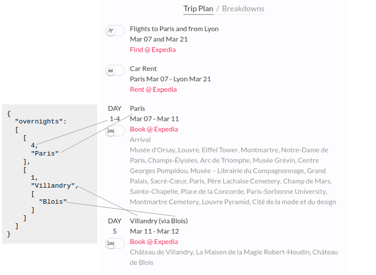

## Endpoints

| Endpoint | Description |
| ----- | --------- | 
| [Get Trip](#get-trip) | Get trip, optimized for curiosity by time and budget | 
| [Geocode Trip](#geocode-trip) | Get GeoJSON for trip to show it on the map  | 


## Get Trip

Get trip, optimized for curiosity by time and budget. 
Most of the parameters are intuitive. Below is visual mapping of most important parameters to [Curiosio website](http://beta3.ingeenee.com/)


### Resource

`POST /api/v1/trip/find`

### Authorization

Valid `api_key` to be provided.

## Post Parameters

| Name          | Type      | Description                                                                   |
| ------------- | --------- | ----------------------------------------------------------------------------- |
| `countries` | `string`  | List of [ISO 3166-1 alpha-2](https://en.wikipedia.org/wiki/ISO_3166-1_alpha-2) codes, separated by `|` | 
| `start_date`  | `string`  | Trip start date in YYYY/MM/DD format   | 
| `days`        | `integer` | Planned trip duration, in full days. Please use range of 3 - 28 days.  | 
| `budget`      | `integer` | Expected trip budget, in US dollars. Please use range of $100 - $10,000 | 
| `geeks`      | `integer` | Number of adult travelers, from 1 to 6 | 
| `children`      | `integer` | Number of children, from 0 to 4 | 
| `cars`        | `integer` | Number of cars to rent, 1 or 2 | 
| `comfort`        | `string` | Desired comfort level, one of following: `frugal`, `normal`, `upscale` | 
| `intensity`        | `string` | Desired curiosity level, one of following: `relaxed`, `normal`, `vigorous` 
| `mode`        | `string` | 'narrow' or 'wide'. Please use 'narrow' search for faster results | 
| `results`      | `integer` | Number of search results. The results are sorted by relevance, and requested number of trips is returned. Please use range from 1 to 50.   | 
| `avoid` | `list`  | List of strings, each item represents destination to avoid | 
| `thru` | `list`  | List of travel-thru destinations (see below) | 

### Travel-thru destination item

| Name          | Type      | Description                                                                   |
| ------------- | --------- | ----------------------------------------------------------------------------- |
| `id` | `string`  | Name of destination, equals to title of wikipedia page
| `iso` | `string`  | [ISO 3166-1 alpha-2](https://en.wikipedia.org/wiki/ISO_3166-1_alpha-2) code of the destination |
| `disp` | `string`  | Display name of destination |
| `type` | `string`  | Should be `city` |


### Example

```json
{ "countries": "AU",
  "start_date": "2019/03/06",
  "days": 15,
  "budget": 3000,
  "geeks": "2",
  "children": "0",
  "cars": "1",
  "comfort": "normal",
  "intensity": "normal",
  "mode": "narrow",
  "results": 3,
  "avoid": ["Nice", "Marseille"],
  "thru": 
   [ { "id": "Paris", "iso": "AU", "disp": "Paris", "type": "city" },
     { "id": "Toulouse", "iso": "AU", "disp": "Toulouse", "type": "city" },
     { "id": "Lyon", "iso": "AU", "disp": "Lyon", "type": "city" } ]
}
```


## Response

Below is visual mapping of response to [Curiosio website](http://beta3.ingeenee.com/)


### Response Example 

`Status-Code: 200 OK`
```json
{
  "statusCode": 200,  
  "trips": [
    {
      "iso": "FR",
      "start_date": "2019/03/07",
      "end_date": "2019/03/21",
      "budget": "$3000 - $3600",
      "mileage": 1477,
      "comfort": "normal",
      "intensity": "normal",
      "days": 15,
      "people": 2,
      "children": 0,
      "cars": 1,
      "relevance": {
        "score": 99
      },
      "breakdowns": {
        "bd_cb": "$500 - $600",
        "bd_cinter": "$800 - $900",
        "bd_cintra": "$100 - $100",
        "bd_cvital": "$1500 - $1900",
        "bd_cother": "$100 - $100",
        "bd_ctotal": "$3000 - $3600",
        "bd_tb": "85h - 101h",
        "bd_tinter": "20h - 22h",
        "bd_tintra": "31h - 37h"
      },
      "route": "<route>",
      "overnights": "<overnights>"
    }
  ]
}
```

### Response Parameters

| Name          | Type      | Description                               |
| ------------- | --------- | ----------------------------------------- |
| `statusCode`       | `integer`    | Status code, similar to HTTP codes. 200 is OK | 
| `trips`  | `[] trip` | List of trip plans, below are details on each field of trip object |
| `trip.iso` | `string` | Primary country of the trip |
| `trip.start_date` | `string` | Trip start date |
| `trip.end_date` | `string` | Trip end date |
| `trip.budget` | `string` | Trip budget range, in US dollars |
| `trip.mileage` | `integer` | Trip total mileage, in kilometers |
| `trip.people`      | `integer` | Number of adult travelers | 
| `trip.children`      | `integer` | Number of children | 
| `trip.cars`        | `integer` | Number of cars to rent (there will be no car proposed even if requested, if trip is within single city) | 
| `trip.comfort`        | `string` | Trip comfort level, one of following: `frugal`, `normal`, `upscale` | 
| `intensity`        | `string` | Trip curiosity level, one of following: `relaxed`, `normal`, `vigorous` |
| `trip.relevance.score`        | `integer` | Trip relevance, in range 0 - 100 percent. Score of 100 means perfect match to search criteria. Trip relevance takes into account many parameters, for instance budget, duration, inter-city drive times, number of stays per single city.  |
| `trip.breakdowns` | `breakdowns` | Details for budget and time ranges, see details below | 
| `trip.route` | `route` | Trip route, as two-level list of cities and POI/experiences within cities | 
| `trip.overnights` | `overnights` | Overnight plan, see details below | 


### Breakdowns 
| Name          | Type      | Description                               |
| ------------- | --------- | ----------------------------------------- |
| `bd_cb`       | `string`    | Budget range: Admissions | 
| `bd_cinter`   | `string`    | Budget range: Car & Road | 
| `bd_cintra`   | `string`    | Budget range: Lodging & Food | 
| `bd_cvital`   | `string`    | Budget range: In Situ | 
| `bd_cother`   | `string`    | Budget range: Other | 
| `bd_ctotal`   | `string`    | Budget range: Total | 
| `bd_tb`       | `string`    | Time range: Experience | 
| `bd_tinter`   | `string`    | Time range: En Route | 
| `bd_tintra`   | `string`    | Time range: In Situ | 


### Overnights

Overnight plan is list of items, each item containing number of days and city name.

See the following example 

```json
{
  "overnights": 
  [
    [
      4,
      "Paris"
    ],
    [
      1,
      "Villandry",
      [
        "Blois"
      ]
    ]
  ]
}
```
There are two stays. First is 4 days in `Paris`, second is one day in `Villandry`, visiting `Blois` on the road from `Paris` to `Villandry` (without staying in `Blois` overnight)

Below is visual mapping of overnight to [Curiosio website](http://beta3.ingeenee.com/)




## Geocode Trip

Get GeoJSON for trip to show it on the map. Geocode method should be called for each trip plan. For performance reasons we suggest calling `geocode` method only on demand (when there is a need to show the route on the map), avoiding bulk calls.

### Resource

`POST /api/v1/trip/geocode`

### Authorization

Valid `api_key` to be provided.

## Post Parameters

| Name          | Type      | Description                                                                   |
| ------------- | --------- | ----------------------------------------------------------------------------- |
| `plan` | `trip`  | Response from Get Trip call (item from the `trips` list)


### Example

```json
{
  "plan": {
    "budget": "$2900 - $3400",
    "cars": 1,
    "children": 0,
    "comfort": "normal",
    "days": 15,
    "..." : "remaining data of the plan is omited for documentation clarity"
}
```

### Response Example
For documentaiton clarity, [GeoJSON](http://geojson.org/) values are replaced by "<GeoJSON>" string.
`Status-Code: 200 OK`
```json
{
  "edges": "<GeoJSON>",
  "stays": "<GeoJSON>",
  "visits": "<GeoJSON>",

  "roads_lo": {
    "singleLine": "<GeoJSON>",
    "multiLine": "<GeoJSON>",
    "parts": "<GeoJSON>"
  },
  "roads_hi": {
    "singleLine": "<GeoJSON>",
    "multiLine": "<GeoJSON>",
    "parts": "<GeoJSON>"
  }
}
```

### Response Parameters

| Name          | Type      | Description                                                                   |
| ------------- | --------- | ----------------------------------------------------------------------------- |
| `edges` | `GeoJSON`  | GeoJSON representing start and end of the route. Contains GeoJSON Point features. )
| `stays` | `GeoJSON`  | GeoJSON representing overnight cities. Contains GeoJSON Point features. )
| `visits` | `GeoJSON`  | GeoJSON representing visited cities without overnight stay. Contains GeoJSON Point features. )
| `roads_hi` | `roads`  | Roads structure (details below), high-resolution, for detailed zoom levels )
| `roads_lo` | `roads`  | Roads structure (details below), low-resolution, for overview zoom levels )
| `roads.singleLine` | `GeoJSON`  | GeoJSON for trip geometry, as single coordinates array. Contains GeoJSON LineString. )
| `roads.multiLine` | `GeoJSON`  | GeoJSON for trip geometry, as array of coordinates arrays for road segments between cities. Contains GeoJSON MultiLineString. )
| `roads.parts` | `GeoJSON`  | GeoJSON for trip geometry, as array of coordinates arrays for road segments, split to even parts. Could be used for timer-based animation of roads over the map. Contains GeoJSON MultiLineString. )


